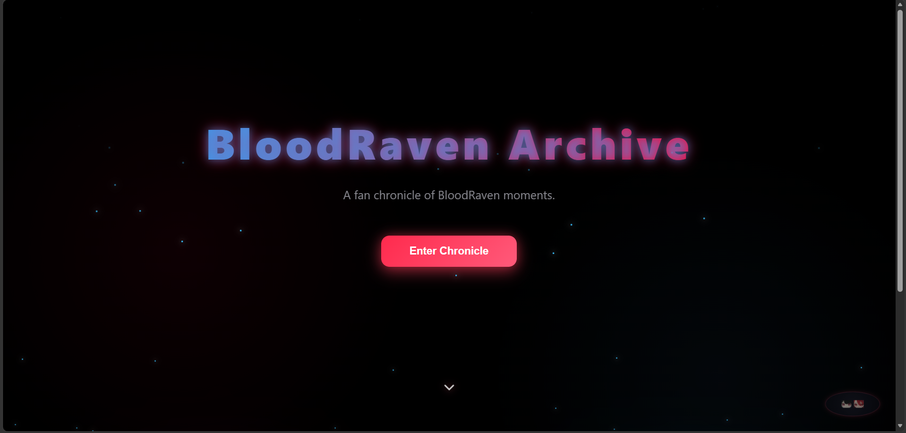
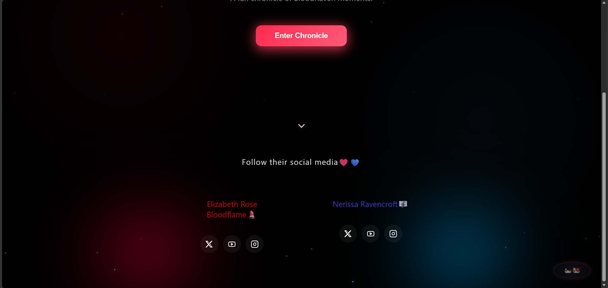
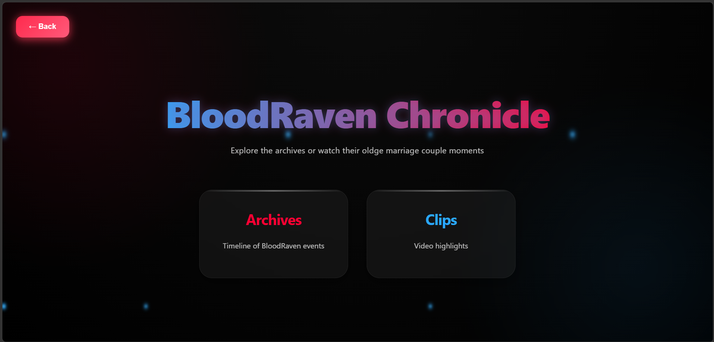
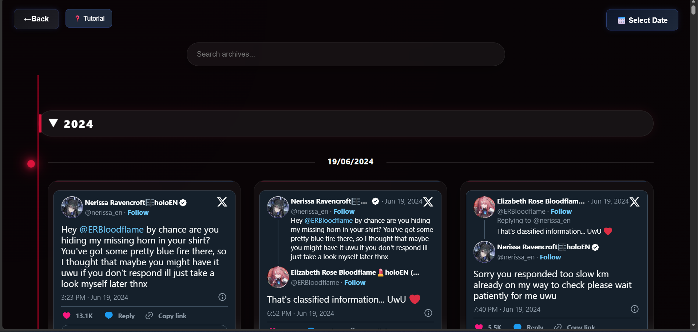

# BloodRaven Archive

An interactive archive website built with Vue.js featuring timelines, clips, quizzes, and searchable content.

## Live Demo

🌐 https://xeroedels.github.io/bloodravenarchives/#/

## Repository

📂 https://github.com/xeroedels/bloodravenarchives

## Features

- Interactive Timeline
- Year Filtering
- Expandable Event Cards
- BloodRaven Clips Archive
- Quiz System
- Persistent Leaderboard
- Responsive Design
- Page Transitions
- Scroll To Top Button

## Screenshots

### Homepage




### Gateway



### Timeline



## Tech Stack

- Vue.js
- JavaScript
- HTML5
- CSS3
- Vite
- Local Storage

## Installation

```bash
npm install
npm run dev
```

## Build for Production

```bash
npm run build
```

## Future Plans

- Tutorial / Onboarding Overlay
- Additional Archive Categories
- More Quiz Content
- Advanced Search Features

## Author

Xero
